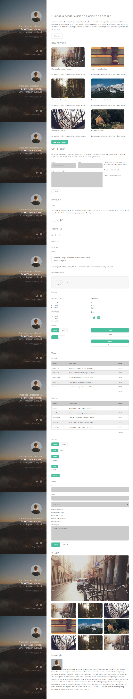

# Strata

## Sobre o projeto.
Site desenvolvido para treinar algumas tags e elementos do HTML. A lateral é fixa, porém na imagem do readme eu dupliquei para não ficar vazio. 

Data de conclusão: 20/05/2022
## Ferramentas e tecnologias usadas nesse projeto.
 
```js
function Strata(Project) {
    if (Front End) {
        const Stack = `${HTML}, ${CSS}`;
    }
};
```
<br>

<div align="center">



</div>

<br><br>

---

> - Autores: 
>   - [Eduardo Kayke](https://github.com/EduardoKayke "Perfil do Eduardo")

- [Voltar ao perfil do Github.](https://github.com/EduardoKayke "Perfil do Eduardo")

_Um dia seremos a tecnologia. Biohacking a própria evolução de nós mesmos._

